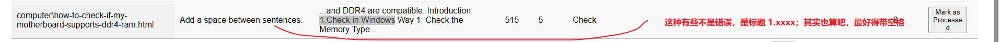
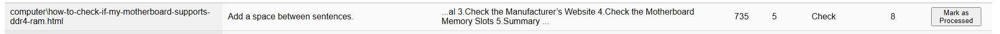
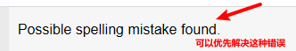
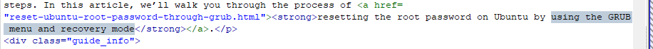
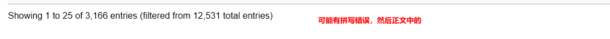
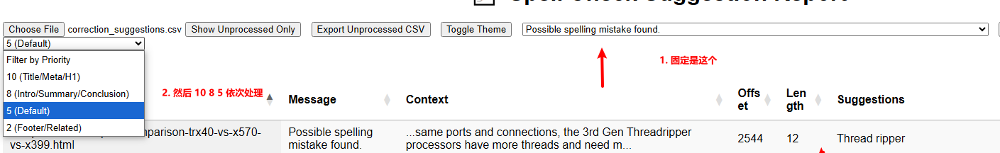

# 📝 Spell Checker for Website HTML

这是一个基于 Python 和 LanguageTool 的网站拼写检查工具，支持：

- ✅ HTML 网页正文内容批量拼写检查
- ✅ 支持跳过特定单词、错误类型、标签等
- ✅ 优先级评分（SEO 影响评估）
- ✅ 行业术语命中检查
- ✅ 结果导出为 JSON/CSV + 可交互 HTML 报表
- ✅ 错误处理状态本地保存，可跨浏览器导入/导出

------

## 📁 项目结构

```bash
.
├── config.json                     # 可配置项：忽略单词、标签、路径、术语表
├── language-tool-lib-spell-checker.py   # 主检查脚本
├── correction_suggestions.csv     # 拼写问题建议清单（含优先级）
├── spell_report.json              # 原始结构化报告
├── processed_files.txt            # 已检查过的 HTML 文件路径
├── report.html                    # 可交互的前端查看器
├── report.js                      # 前端交互逻辑（由 script src 引入）
└── processed_status.json          # [可选导出] 错误已处理标记
```

------

## ⚙️ 使用方式

### 1. 安装依赖

```bash
pip install language-tool-python beautifulsoup4 tqdm
```

这个还需要 Java17 以上（因为 Language Tool 需要）

### 2. 配置 `config.json`

```json
{
  "skip_words": ["Achilles.H", "CloneGo", "iSunshare"],
  "skip_messages": ["Some style guides suggest that commas should set off the year in a month-day-year date"],
  "skip_tags": ["script", "style", "noscript", "code", "iframe"],
  "max_characters_per_file": 10000,
  "input_directory": "D:/cg/shareus_web/trunk/",
  "glossary": ["Cloudflare", "SMTP", "IMAP", "POP3", "CDN", "DDoS", "nslookup"]
}
```

### 3. 运行脚本

```bash
python language-tool-lib-spell-checker.py
```

输出：

- `spell_report.json`：完整结构化拼写问题数据
- `correction_suggestions.csv`：更易处理的列表，含优先级评分和术语命中标记

------

## 🧠 优先级评分规则（SEO敏感度）

| 元素位置                        | 优先级评分 |
| ------------------------------- | ---------- |
| `<title>` `<meta>` `<h1>`       | 10         |
| 首段关键内容（如 introduction） | 8          |
| 正文中段（默认）                | 5          |
| 页脚、版权、导航等非核心位置    | 2          |

字段在 `correction_suggestions.csv` 的 `PriorityScore` 中呈现。

------

## 📊 报告查看器

打开 `report.html` 可交互式查看和标记：

- ✅ 按 Message 类型筛选
- ✅ 标记为已处理（本地存储）
- ✅ 导出未处理项 CSV
- ✅ 导出/导入处理状态（JSON）
- ✅ 暗色模式切换

------

## 🔐 状态持久化机制

- 所有“已处理”标记使用 `localStorage` 保存于浏览器本地。
- 可通过页面右上角按钮导出状态为 `processed_status.json`，在新浏览器导入恢复。

------

## 🧩 TODO / 可扩展方向

- 🔍 支持多语言拼写检查（`config["language"]`）
- 🌐 部署成 Flask / Streamlit 小型 Web App
- 📏 加入 Proselint、Vale 进行风格/术语一致性检查
- 🕵🏻 重复问题去重 / 聚类优化输出

------

如需部署成 Web 工具，建议下一个阶段使用 Flask + DataTables + API 异步处理。

需要我直接提供部署版本框架、Dockerfile 或自动化打包的话，随时说！✅

### 问题

标记为已处理之后，没有设计取消的逻辑

1. 跳过 table；==还有的命令是包裹在 <b>之类的里边的，这就比较麻烦==; (这是最麻烦的!)shareus.com/computer/detailed-tutorial-for-creating-a-windows-11-backup-image.html
2. 对于嵌套标签处理还不太行( p 里嵌套 <strong> <b> 这些）
2. 添加一个展示已经改过的展示；
3. 展示未处理的，其实并没有生效，**总之还有不少小问题**；哈哈(还不怎么能用)
4. 设置成==某个具体类型的拼写错误只出现一次就好了==，因为改的时候可以批量更新；

某些错误消息也是可以过滤过去的；



可能还是限制在正文更好一些？

这种不算错误：


offset 属于什么，怎样才能更方便地定位呢？



==Possible spelling mistake found==. 更加实用的解决：先解决了这种错误!!!



会识别成 `and recovery mode .` 所以会报这个错：Don’t put a space before the full stop. (感觉这种也可以忽略)

## 处理进度

2025年4月22日 

priority 10 和 8

然后是 Possible spelling mistake found. **这种错误类型是真正不会出问题的**

Note:

==chrome 改成 合标准的 Chrome 还要注意不要影响到 ==chrome-xxx-xxx== 这种路径里边的（所以说，在改之前确认一下，大概会改哪些，真的很重要!!）== 这个非常重要，因为一个改不好就有可能会导致图片不显示，或者产生坏链!!! （事后修复 总是不如事前预防一下。）对于这种，暂时不改；

尤其是单个单词这种。Google chrome 这种还不会有什么影响。推荐使用 VSCode 手动查找和替换；



5 Default；	

使用这些筛选条件，改一下还比较合适；(基本功能还算实现了)

shareus 这种也先不改，因为所有路径中都有这个；

一定记得区分大小写；

## 推荐处理顺序



按照 Suggestions 排序（点一下栏标即可）；


