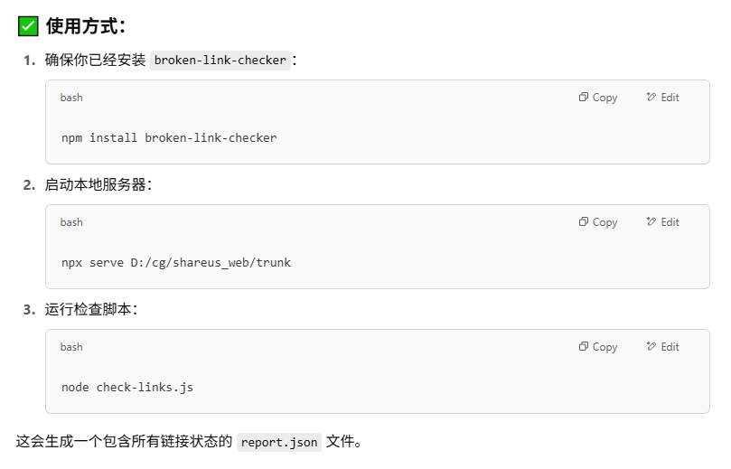
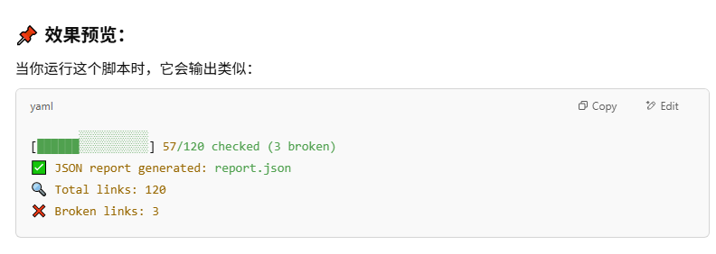
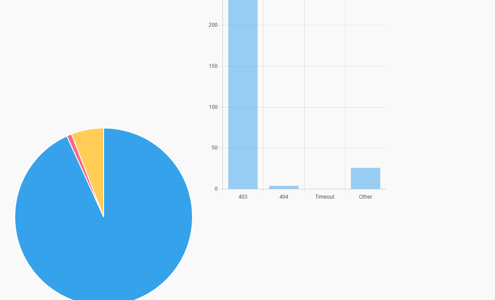
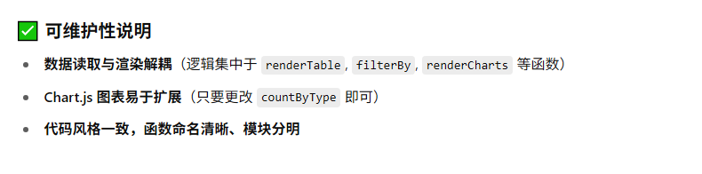

## 如何使用



```bash
npm install broken-link-checker
npx serve D:/cg/shareus_web/trunk
	用 npx serve 起本地服务器
	把你的 HTML 静态文件目录发布为本地网页 → 然后工具就能像抓网站一样抓它；浏览器访问地址就是：http://localhost:3000（默认端口）相当于它在检查一个在线网站 → 所有 HTML、图片、样式、JS 都能像真实网站那样被访问和分析。
	💻 离线环境兼容	适合企业/本地审核，无需上传到公网
node check-links.js
```

### check-links.js

```js
// check-links.js
const blc = require("broken-link-checker");
const fs = require("fs");

const results = [];
let totalLinks = 0;
let processedLinks = 0;
let brokenLinks = 0;

function printProgress() {
  const percent = totalLinks ? ((processedLinks / totalLinks) * 100).toFixed(1) : 0;
  const barLength = 20;
  const filled = Math.round((percent / 100) * barLength);
  const bar = "█".repeat(filled) + "░".repeat(barLength - filled);
  process.stdout.write(
    `\r[${bar}] ${processedLinks}/${totalLinks} checked (${brokenLinks} broken)`
  );
}

const checker = new blc.SiteChecker(
  {
    excludeExternalLinks: false
  },
  {
    link: (result) => {
      const isBroken = result.broken;
      const statusCode = result.http.response?.statusCode || null;

      results.push({
        url: result.url.resolved || result.url.original,
        broken: isBroken,
        statusCode,
        message: isBroken ? result.brokenReason || "Unknown" : "OK",
        base: result.base.resolved || ""
      });

      processedLinks++;
      if (isBroken) brokenLinks++;
      printProgress();
    },
    html: (tree, robots, response, pageUrl) => {
      totalLinks += tree.links.length;
    },
    end: () => {
      console.log("\n✅ JSON report generated: report.json");
      console.log(`🔍 Total links: ${totalLinks}`);
      console.log(`❌ Broken links: ${brokenLinks}`);
      fs.writeFileSync("report.json", JSON.stringify(results, null, 2), "utf-8");
    }
  }
);

// 本地服务器起好后检查这个入口地址
checker.enqueue("http://localhost:3000");
```



## 结果可视化

```html
<!DOCTYPE html>
<html lang="zh">
<head>
  <meta charset="UTF-8">
  <title>Broken Link Report</title>
  <style>
    body { font-family: sans-serif; margin: 2rem; background: #f9f9f9; color: #333; }
    h1 { font-size: 1.8em; }
    .toolbar, .filter-buttons { margin-bottom: 1em; }
    .filter-buttons button, button, input[type="file"] {
      margin-right: 0.5em; padding: 6px 12px; cursor: pointer;
    }
    table { width: 100%; border-collapse: collapse; margin-top: 1em; background: #fff; }
    th, td { border: 1px solid #ccc; padding: 8px; font-size: 0.95em; text-align: left; }
    th { background: #f5f5f5; }
    tr.broken-404 { background-color: #ffe0e0; }
    tr.broken-403 { background-color: #fff0cc; }
    tr.broken-timeout { background-color: #e0f0ff; }
    tr.broken-other { background-color: #e6e6e6; }
    canvas { max-width: 400px; margin-top: 2rem; }
    .chart-container { display: flex; gap: 2rem; flex-wrap: wrap; }
  </style>
</head>
<body>
  <h1>🧪 Broken Link Report</h1>

  <div class="toolbar">
    <input type="file" accept=".json" id="fileInput">
    <input type="text" id="filterInput" placeholder="关键词筛选 URL / 状态码 / 消息" oninput="filterRows()">
    <button onclick="exportSelected()">导出选中为 CSV</button>
  </div>

  <div class="filter-buttons">
    <button onclick="filterBy('all')">全部 (<span id="count-all">0</span>)</button>
    <button onclick="filterBy('404')">404 (<span id="count-404">0</span>)</button>
    <button onclick="filterBy('403')">403 (<span id="count-403">0</span>)</button>
    <button onclick="filterBy('timeout')">Timeout (<span id="count-timeout">0</span>)</button>
    <button onclick="filterBy('other')">其他 (<span id="count-other">0</span>)</button>
  </div>

  <table>
    <thead>
      <tr>
        <th><input type="checkbox" id="selectAll" onclick="toggleAll(this)" /></th>
        <th>Status</th>
        <th>Message</th>
        <th>URL</th>
        <th>Base</th>
      </tr>
    </thead>
    <tbody id="reportBody"></tbody>
  </table>

  <div class="chart-container">
    <canvas id="pieChart"></canvas>
    <canvas id="barChart"></canvas>
  </div>

  <script src="https://cdn.jsdelivr.net/npm/chart.js"></script>
  <script>
    let data = [], filteredData = [], charts = {};

    document.getElementById("fileInput").addEventListener("change", function () {
      const file = this.files[0];
      if (!file) return;
      const reader = new FileReader();
      reader.onload = (e) => {
        const json = JSON.parse(e.target.result);
        data = json.filter(d => d.broken);
        updateCounts();
        filterBy('all');
        renderCharts();
      };
      reader.readAsText(file);
    });

    function renderTable(items) {
      const tbody = document.getElementById("reportBody");
      tbody.innerHTML = "";
      for (let item of items) {
        const row = document.createElement("tr");
        const status = item.statusCode || "";
        const message = item.message || "";
        let cls = "broken-other";
        if (status == 404) cls = "broken-404";
        else if (status == 403) cls = "broken-403";
        else if (message.toLowerCase().includes("timeout")) cls = "broken-timeout";
        row.className = cls;
        row.innerHTML = `
          <td><input type="checkbox" class="rowCheck" checked /></td>
          <td>${status}</td>
          <td>${message}</td>
          <td><a href="${item.url}" target="_blank">${item.url}</a></td>
          <td>${item.base}</td>`;
        tbody.appendChild(row);
      }
    }

    function updateCounts() {
      const counts = {
        all: data.length,
        "404": data.filter(d => d.statusCode == 404).length,
        "403": data.filter(d => d.statusCode == 403).length,
        timeout: data.filter(d => d.message?.toLowerCase().includes("timeout")).length,
        other: data.filter(d => ![404, 403].includes(d.statusCode) && !d.message?.toLowerCase().includes("timeout")).length
      };
      for (let key in counts) {
        document.getElementById(`count-${key}`).textContent = counts[key];
      }
    }

    function filterBy(type) {
      switch (type) {
        case "404": filteredData = data.filter(d => d.statusCode == 404); break;
        case "403": filteredData = data.filter(d => d.statusCode == 403); break;
        case "timeout": filteredData = data.filter(d => d.message?.toLowerCase().includes("timeout")); break;
        case "other": filteredData = data.filter(d => ![404, 403].includes(d.statusCode) && !d.message?.toLowerCase().includes("timeout")); break;
        default: filteredData = data;
      }
      renderTable(filteredData);
    }

    function filterRows() {
      const keyword = document.getElementById("filterInput").value.toLowerCase();
      const filtered = filteredData.filter(d =>
        String(d.statusCode).includes(keyword) ||
        d.url.toLowerCase().includes(keyword) ||
        d.message.toLowerCase().includes(keyword)
      );
      renderTable(filtered);
    }

    function toggleAll(box) {
      document.querySelectorAll(".rowCheck").forEach(cb => cb.checked = box.checked);
    }

    function exportSelected() {
      const rows = document.querySelectorAll("#reportBody tr");
      let csv = "Status,Message,URL,Base\n";
      rows.forEach(row => {
        const checkbox = row.querySelector("input.rowCheck");
        if (checkbox && checkbox.checked) {
          const cells = row.querySelectorAll("td");
          csv += `"${cells[1].textContent}","${cells[2].textContent}","${cells[3].textContent}","${cells[4].textContent}"\n`;
        }
      });
      const blob = new Blob([csv], { type: "text/csv" });
      const a = document.createElement("a");
      a.href = URL.createObjectURL(blob);
      a.download = "broken-links.csv";
      a.click();
    }

    function renderCharts() {
      const countByType = {
        "404": data.filter(d => d.statusCode == 404).length,
        "403": data.filter(d => d.statusCode == 403).length,
        "Timeout": data.filter(d => d.message?.toLowerCase().includes("timeout")).length,
        "Other": data.filter(d => ![404, 403].includes(d.statusCode) && !d.message?.toLowerCase().includes("timeout")).length
      };

      const labels = Object.keys(countByType);
      const values = Object.values(countByType);

      // Pie Chart
      if (charts.pie) charts.pie.destroy();
      charts.pie = new Chart(document.getElementById("pieChart"), {
        type: "pie",
        data: { labels, datasets: [{ data: values }] },
        options: { plugins: { title: { display: true, text: "Broken Link 分类比例" } } }
      });

      // Bar Chart
      if (charts.bar) charts.bar.destroy();
      charts.bar = new Chart(document.getElementById("barChart"), {
        type: "bar",
        data: {
          labels,
          datasets: [{ label: "Broken 数量", data: values }]
        },
        options: {
          responsive: true,
          plugins: { title: { display: true, text: "Broken 链接状态统计" } },
          scales: { y: { beginAtZero: true } }
        }
      });
    }
  </script>
</body>
</html>
```

加载可能需要一点时间，等他几秒；

https://cdn.jsdelivr.net/npm/chart.js 因为引入了这个，所以需要代理？（是一个饼图脚本）





## 文件结构

```markdown
/check-html/
│
├─ check-links.js       ← 运行这个生成 JSON
├─ report.json          ← 自动生成的链接数据
├─ report.html          ← 拖进浏览器可视化 + 导出功能
```

